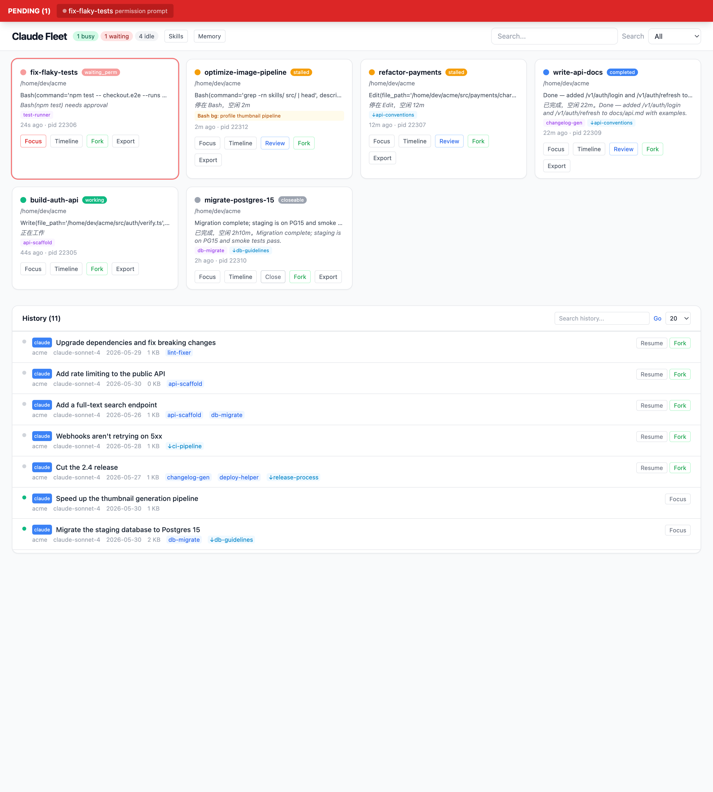
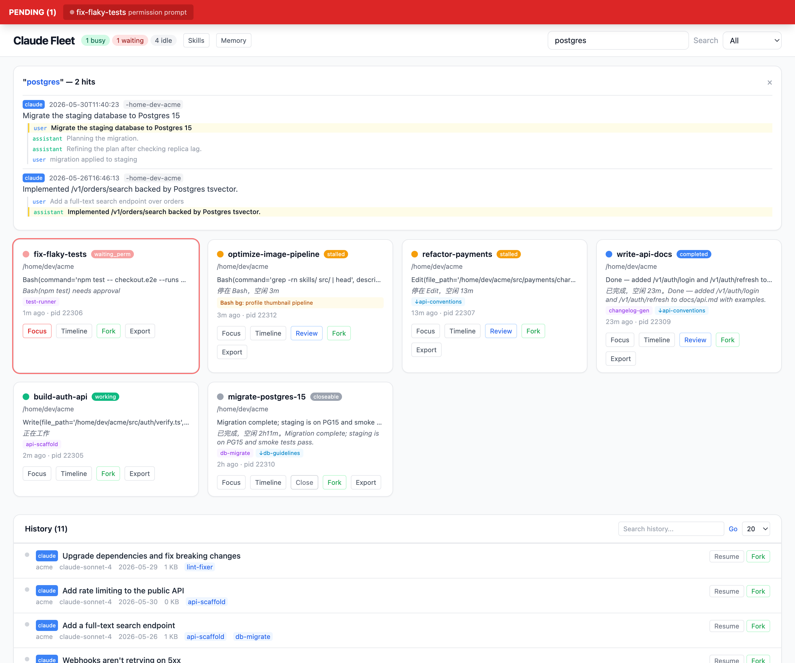
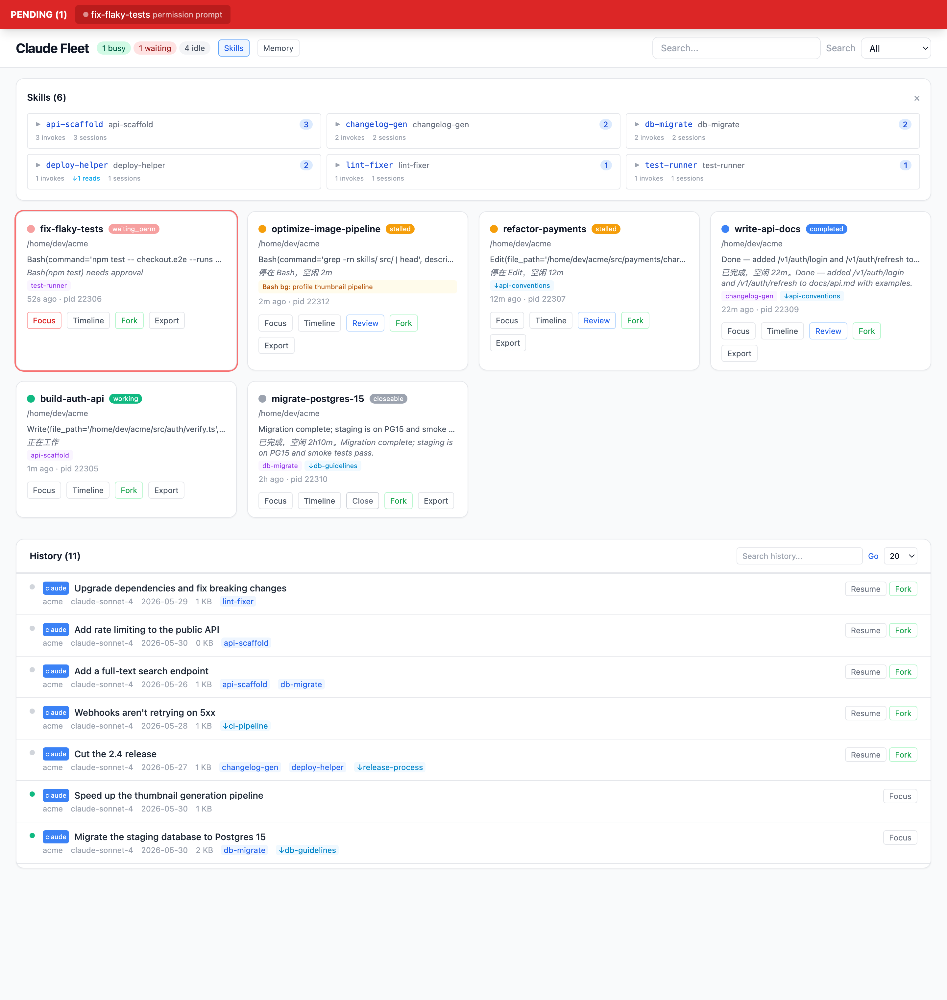
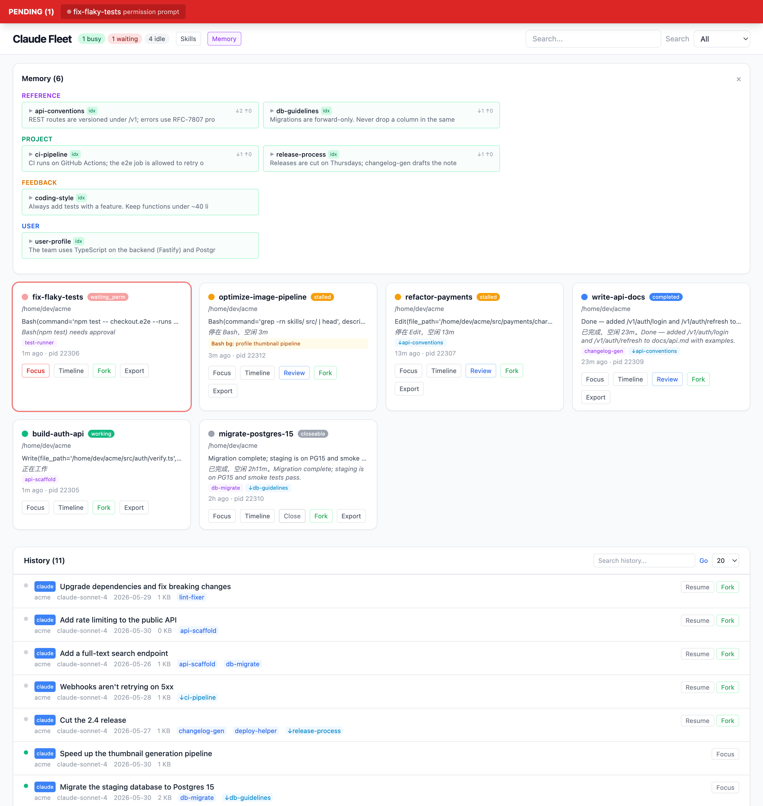
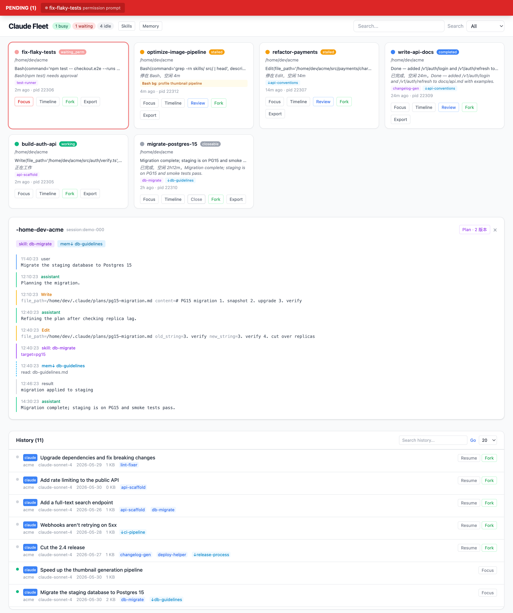

English | [中文](README.zh-CN.md)

# Claude Fleet

When you're vibe coding with 5–7 Claude Code windows open at once, you need one
place to see what every window is doing — who's stuck, who's waiting on you, who's
done, and how much of your usage limit is left.



> A dashboard for running many Claude Code (and Codex) sessions in parallel.
> Built on top of [tianyilt/claude-fleet](https://github.com/tianyilt/claude-fleet)
> — see [Credits](#credits). This fork adds live plan-usage limits, per-card
> model/token readouts, PACE/Slurm GPU-queue monitoring, and sharper triage.

## Run it in 30 seconds

```bash
git clone https://github.com/hungchun0201/claude-fleet
cd claude-fleet && bash run.sh
# open http://127.0.0.1:7878 in your browser
```

The first run creates a venv and installs dependencies automatically — nothing to
set up. Override the port with `CLAUDE_FLEET_PORT`.

The backend only **reads** `~/.claude/` and `~/.codex/` — it never mutates any
agent state. Every person who runs it sees only their own sessions.

## What it solves

The everyday pain of multi-window vibe coding:

- **Permission prompts flash by and you miss them** → a persistent red bar at the top; click it to jump back to that terminal.
- **You don't know what each window is doing** → every card shows the current task, triage status, model, and background jobs.
- **You don't know how close you are to your usage limit** → the navbar shows your real 5-hour session % and weekly all-models % (with reset countdown).
- **Finished windows get left open** → the patrol engine marks them `closeable`; close with one click.
- **A window looks "busy" but is actually stuck** → a disabled model or a dead background shell is surfaced distinctly, not hidden as working.
- **You can't find that session from last week** → full-text search returns in ~50ms with VS Code–style match context.

## Core features

### Triage classification

Not a simple busy/idle flag. The patrol engine reads each transcript's
`stop_reason`, `queue-operation` events, API-error rows, and background-task state:

| Status | Meaning | How it's decided |
|--------|---------|------------------|
| 🟢 working | actively working | busy, or live background work (bg Bash / Monitor / Workflow / Codex review / GPU wait) |
| 🔴 waiting | waiting on you | permission prompt / dialog open |
| 🟡 stalled | stuck, needs you | stop_reason=tool_use + idle > 5 min; a hung Codex review / Workflow / overdue wakeup; **or the selected model was disabled mid-turn** (run `/model` to recover) |
| 🔵 completed | done | stop_reason=end_turn + idle > 5 min |
| ⚪ closeable | safe to close | completed + idle > 1 h |

Classification is structural — the patrol engine pairs tool_use/tool_result and
task notifications instead of keyword-matching prose, so a session that merely
*talks about* background work doesn't read as working, and finished tasks clear
automatically. What it tracks:

- **Background tasks** — `Bash run_in_background` / `Monitor persistent` /
  `Workflow` runs, through their full spawn-ack → task-notification lifecycle.
  A turn that ends while they run stays `working`, not `completed`.
- **Workflow runs** — ⚙️ badge with live agent progress (done/started, read from
  the run's journal); flagged stalled after 15 min without output.
- **Model-disabled turns** — when a turn aborts because the selected model was
  revoked (a synthetic API-error row), the card reads `stalled` with a `/model`
  hint instead of falsely reading "working".
- **Lingering background shells** — when a turn ends but a background shell is
  still alive (a forgotten server, a bare `&`), the card no longer forces
  "working": it completes and shows a 🐚 badge with **what the shell is actually
  running** (read live from the process tree), so a dead shell never masquerades
  as work.
- **GPU waits (Slurm / PACE)** — sessions sleeping on a ScheduleWakeup or running
  a queue-poll waiter get a ⏳ badge with the next wake time; the dashboard polls
  `sacct`/`squeue` itself over SSH and shows the latest job states on the card.
  Requires real Slurm/GPU tokens (`squeue`, job ids, H100/L40S, …) — a mere
  hostname doesn't count.
- **Codex reviews** — 🔍 badge for `codex exec` children and in-flight MCP
  calls, with stall detection (silent or missing rollout) and optional one-shot
  [ntfy](https://ntfy.sh) push alerts. Set `CLAUDE_FLEET_NTFY_TOPIC` or write
  the topic to `~/.config/claude-fleet/ntfy-topic`; unset = alerts disabled
  (topics act like passwords, so there is no default).

### Plan & token usage

The navbar mirrors **Settings → Usage** with your account's real numbers, fetched
read-only from `/api/oauth/usage` using the OAuth token Claude Code keeps in your
keychain:

- **`5h <tokens> / <pct>%`** — current 5-hour session: a local billable-token
  estimate plus the account's real utilization %, with a `reset in 3hr Xmin`
  countdown.
- **`week <pct>%`** — the weekly all-models cap.

The live fetch runs on a slow background poller (≈ every 5 min) so it never blocks
the dashboard, falls back to a local token estimate if the endpoint is
unavailable, and is opt-out via `CLAUDE_FLEET_PLAN_USAGE=0`. Each card also shows
the session's **model** and **current context-window token count**.

> The usage endpoint is undocumented and OAuth-gated; this reads *your own* token
> against *your own* account, read-only. Disable it if you'd rather not.

### Search

ripgrep across all Claude + Codex transcripts, ~50ms. It doesn't just search
session titles — searching "hailuo" finds a session that mentioned Hailuo in the
conversation, even if the title is something else. Each result carries up to 3
match-context snippets so you can see at a glance why it matched.



### Skill / memory tracking

The skill panel reports three dimensions — formal `/skill` invokes, file
read/write of skill files, and Bash references to `skills/`:

```
paper2video        333   1 invoke · ↓122 reads · ↑53 writes · 157 bash
feishu-notify       45  24 invokes · ↓7 reads · ↑7 writes · 7 bash
```

The memory panel groups by type (user / feedback / project / reference) and shows
`↓3 ↑2` per entry (read by 3 sessions, modified by 2).




### Timeline + plan history

Open any session to see the full conversation flow — skill calls in purple, memory
reads dashed blue, memory writes pink — plus the session's plan version history
(each Write a full snapshot, each Edit a red/green diff).



### Actions

| Button | What it does |
|--------|--------------|
| Focus | jump to that terminal tab |
| Fork | `claude --resume <sid> --fork-session` — new session inherits the history |
| Resume | `claude --resume <sid>` — continue the original session |
| Review | run `claude -p` review in the background; the verdict (PASS/FAIL/PARTIAL) shows on the card |
| Close | SIGTERM |
| Export | export a conversation doc (timeline + plan history + skill/memory summary) |

> **Focus setup (macOS).** Works out of the box on Terminal.app and iTerm2 —
> including sessions running inside **tmux** (the bundled
> [`scripts/focus-tty.sh`](scripts/focus-tty.sh) maps process tty → owning tab →
> raises it). Drop an executable `~/.claude/focus-tty.sh` taking a `<tty>` arg to
> customize.

## Privacy

Designed to be safe to share and screenshot:

- **Read-only**: the backend never writes to `~/.claude` / `~/.codex`.
- **No leaked paths**: home paths render as `~/…` in the UI, so screenshots don't
  expose your username.
- **No baked-in secrets**: the ntfy topic and plan-usage are resolved at runtime
  from your own env/keychain; nothing personal is committed.

## Architecture

Single-file frontend (Alpine.js + Tailwind via CDN — no npm). FastAPI backend,
SSE-pushed every 2 s.

```
app.py                FastAPI + SSE; GPU-queue and plan-usage pollers
core/
  sessions.py         read sessions/*.json, map to TTY
  transcripts.py      parse JSONL; skill/memory/plan/background/usage extraction
  patrol.py           triage classification engine
  usage.py            local billable-token aggregation (5h window)
  plan_usage.py       real account limits via /api/oauth/usage (read-only, cached)
  shells.py           live background-shell inspection (process tree)
  codex.py            Codex session parsing + review detection
  search.py           cross-platform ripgrep search
  actions.py          focus / fork / review / close / export
  history.py          unified index + full-text rg search
  skills.py / memory.py / plans.py / perms.py / alerts.py
static/index.html     single-file SPA
```

## Credits

Originally created by **[Tianyi (tianyilt)](https://github.com/tianyilt)** as
[**tianyilt/claude-fleet**](https://github.com/tianyilt/claude-fleet) — the triage
engine, search, skill/memory tracking, and the whole single-file architecture come
from there. This repository is a fork that adds live plan-usage limits, per-card
model/token readouts, PACE/Slurm GPU-queue monitoring, model-error & lingering-shell
triage, and path redaction. All credit for the original design goes to Tianyi.

Upstream also acknowledges:

- [HarnessKit](https://github.com/RealZST/HarnessKit) — UI reference for cross-platform skill management
- [Synergy](https://github.com/SII-Holos/synergy) — inspiration for the memory-engram classification view

## License

[MIT](LICENSE)
